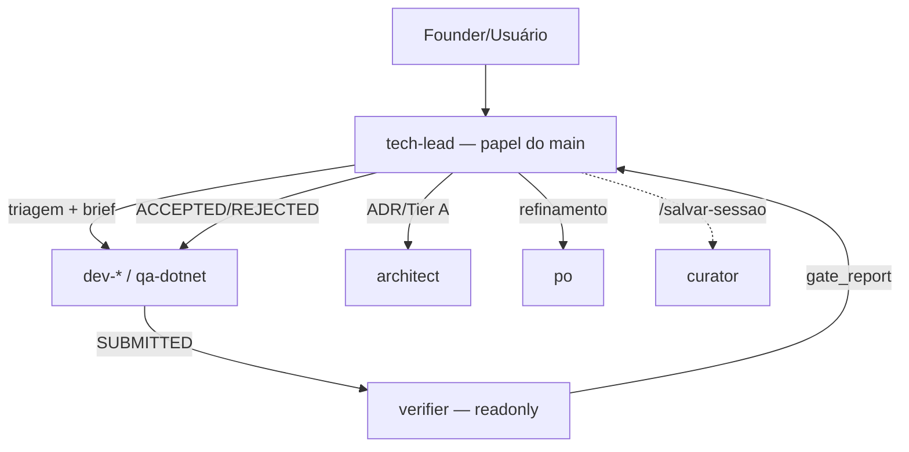
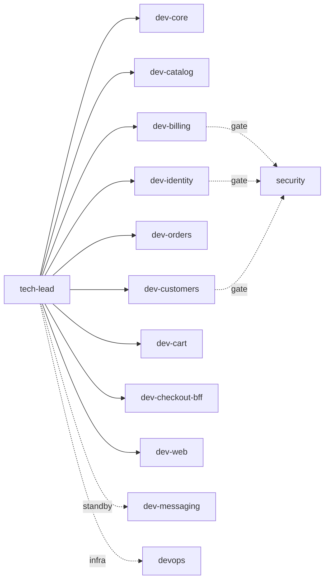
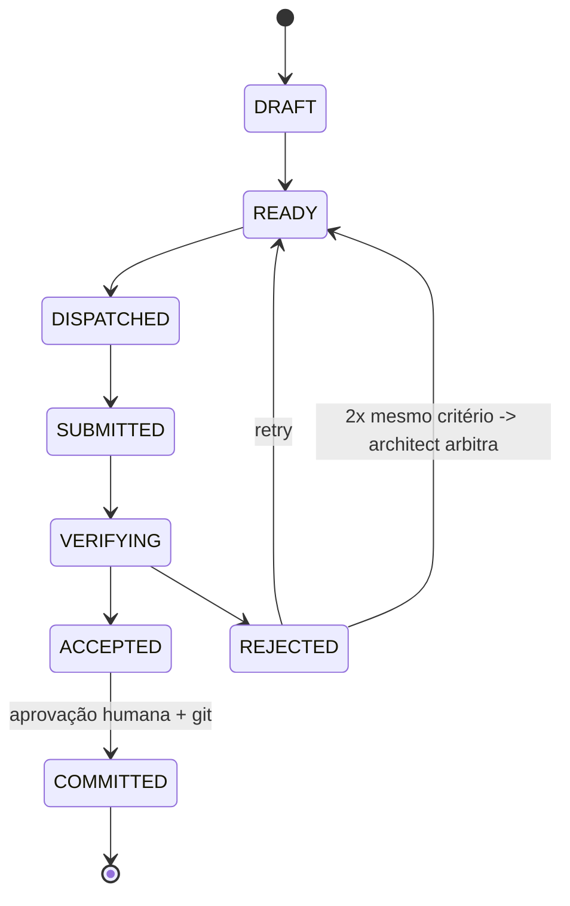
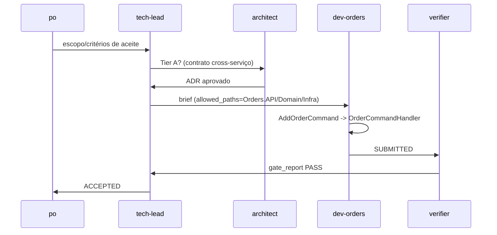
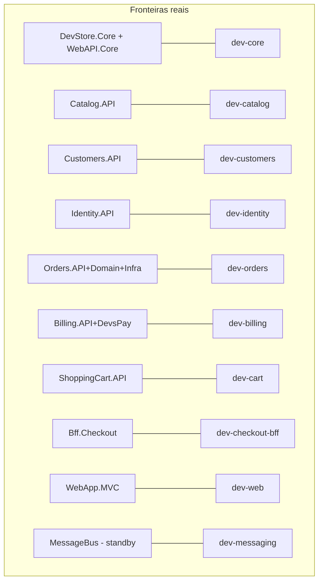
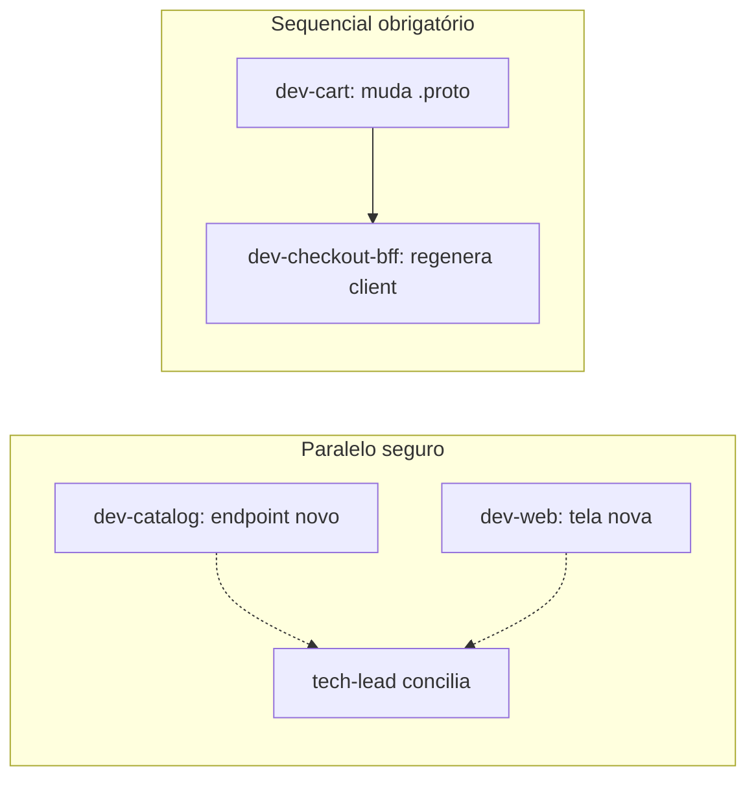
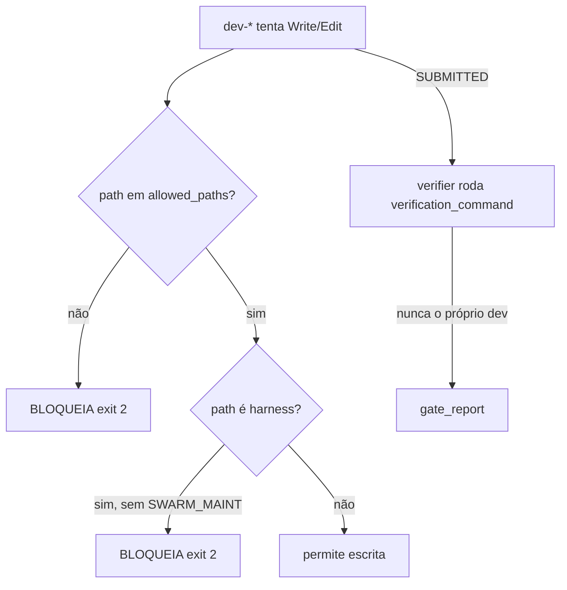
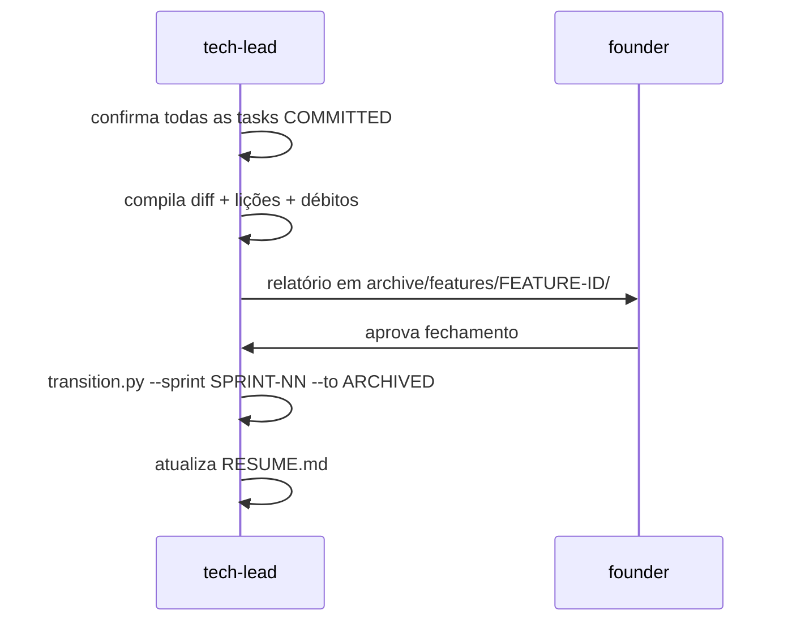

# SWARM_DIAGRAM — DevStore (Fable v9/v11)

Diagrama de onboarding/debugging do harness. Ver [SWARM.md](../../SWARM.md) para a visão
diagnóstica (o que o harness É). Este arquivo é ONBOARDING — como as peças se encaixam na
prática, com os agentes/fronteiras REAIS deste repositório, não um template genérico.

## 1. Visão geral do harness

O tech-lead (papel do agente principal, nunca subagente) triagem, monta briefs e despacha para
17 agentes derivados do scan real do DevStore — 9 `dev-*` de bounded context, 1 `dev-messaging`
em standby, `qa-dotnet`, `verifier`, `po`, `curator`, `architect`, `security` e `devops` (gates).
Nenhum subagente tem tool de delegação (Agent/Task) — delegação é de nível único, sempre.

## 2. Hierarquia e roteamento de agentes

Roteamento é por território real (não por adivinhação): bug em `CreditCardPaymentFacade.cs`
vai para `dev-billing`; endpoint novo em `CatalogController.cs` vai para `dev-catalog`; contrato
gRPC em `Protos/shoppingcart.proto` cruza `dev-cart`↔`dev-checkout-bff` e pode exigir
`architect` se o contrato mudar. `security` é gate transversal (auth/PII/pagamento);
`devops` cobre `docker/`, `.github/workflows/`, `WebApp.Status`.

## 3. Ciclo de vida de task e rework

Máquina canônica (`core-spec.md §1`): `DRAFT → READY → DISPATCHED → SUBMITTED → VERIFYING →
(ACCEPTED | REJECTED)`. REJECTED volta a `READY` para retry; 2 REJECTED no MESMO critério aciona
arbitragem do `architect` (D7) em vez de insistir no loop. `PARTIAL` (escopo cresceu/faltou
contexto) re-escopa o brief, nunca força o agente a sair do `allowed_paths`.

## 4. Fluxo típico de feature

Exemplo real da fronteira Orders: uma feature que toca `AddOrderCommand` passa por
`OrderCommandHandler` (valida → aplica Voucher via `VoucherValidation` → `CalculateOrderAmount`
recalcula no servidor, nunca confia no `Amount` do cliente — BIZ-2 — → paga via
`_bus.Request<OrderInitiatedIntegrationEvent>` síncrono → persiste → publica
`OrderDoneIntegrationEvent`). Se a feature for Tier A (contrato entre serviços), passa por
`architect` (ADR) ANTES do dev-*; se for bug-fix confirmado, vai direto a `dev-orders` → `verifier`.

## 5. Subagentes vs fronteiras reais do repo

Cada `dev-*` mapeia 1:1 para uma fronteira real do `ARCHITECTURE_TREE.md` — não é um template
com 4 slots fixos: `dev-orders` sozinho cobre 3 projetos (`Orders.API`+`Domain`+`Infra`) porque
compartilham stack/fluxo; `dev-billing` cobre `Billing.API`+`Billing.DevsPay` pela mesma razão.
`dev-messaging` fica em standby porque não há Saga/StateMachine real hoje (grep vazio) — só
ativa se essa realidade mudar.

## 6. Modos sequencial, paralelo e background

Despachos SEM interseção de `allowed_paths` podem ir em paralelo (ex.: `dev-catalog` e
`dev-web` numa feature que toca as duas pontas). Despachos que dependem um do outro (ex.:
`dev-cart` altera `Protos/shoppingcart.proto` → `dev-checkout-bff` regenera o client gRPC) são
sequenciais. Nunca dois agentes com interseção de `allowed_paths` ao mesmo tempo — o
`guard-allowed-paths.sh` bloqueia por task ativa, não por cortesia.

## 7. Leis de handoff e `allowed_paths`

Executor nunca verifica/aceita o próprio trabalho (P2). `allowed_paths` do brief é a única
superfície de escrita do subagente — `guard-allowed-paths.sh` (PreToolUse Write|Edit) bloqueia
fail-closed sem task ativa ou fora do escopo. `protect-harness.sh` bloqueia QUALQUER ator
editando `.claude/`/`.swarm/scripts-harness/`/kernel fora de `SWARM_MAINT=1`.

## 8. Ritual de fechamento (`/fechar-feature` + `/fechar-sprint`)

`/fechar-feature`: exige TODAS as tasks da feature em `COMMITTED`, compila o diff completo,
resume objetivo entregue vs planejado, lista débitos conhecidos, gera relatório em
`.swarm/archive/features/FEATURE-ID/` — nunca altera a máquina de sprint. `/fechar-sprint`:
exige sprint 100% `COMMITTED` (nunca `ACCEPTED` sem commit — foi exatamente o furo que perdeu
os 2 INITs anteriores deste projeto), arquiva briefs+logs, atualiza `RESUME.md`.

