# Fluxo do Sistema — DevStore

> **Fonte:** este documento consolida `ORCHESTRATION_MAP.yaml` e `ARCHITECTURE_TREE.md` (ambos `verified: true`), cruzados com o código real de cada fronteira. Cada afirmação de fluxo cita a âncora `arquivo:linha` quando disponível. Onde a rota exata não pôde ser confirmada pelo contexto extraído, a incerteza está declarada explicitamente — não inferida.
>
> **Status:** DevStore é um e-commerce dividido em 9 serviços de domínio + 1 BFF de checkout + 1 web MVC, mais 2 gates operacionais (devops/qa). A comunicação cross-serviço usa exatamente **dois padrões estabelecidos**: síncrono bloqueante (`_bus.Request<>`, ex. Orders→Billing) e assíncrono fire-and-forget (Publish/Consume, demais fluxos). **Não existe HTTP síncrono direto entre serviços de domínio** — só o BFF e o web falam HTTP com os serviços; entre serviços de domínio o transporte é sempre RabbitMQ via MassTransit.

---

## 1. Visão geral

O DevStore organiza-se em quatro camadas de responsabilidade sobre um único shared kernel. `DevStore.Core` + `DevStore.WebAPI.Core` (fronteira dev-core) é a raiz da árvore de dependências, sem nenhuma dependência de saída: fornece `Entity`/`IAggregateRoot`, a seleção multi-provider de banco (`ProviderSelector`), a configuração de JWT/health checks e o bootstrap de MassTransit/RabbitMQ (`AddMessageBus`) que **todos** os serviços consomem. Acima dele vivem os bounded contexts de produto (catalog, customers, identity, orders, billing, cart), que se integram entre si exclusivamente por mensageria; o `Bff.Checkout` orquestra os serviços de produto via HTTP e gRPC para o frontend; e o `WebApp.MVC` é 100% consumidor HTTP do BFF e de alguns serviços diretos (Identity/Catalog/Customer). À margem, dois gates: `WebApp.Status` (devops) faz polling de health e o projeto de testes (qa-dotnet) cobre hoje apenas Catalog. A fronteira dev-messaging permanece em standby — não há Saga/StateMachine formal no repo; a orquestração cross-serviço é ad-hoc (Request/Response ou compensação manual).

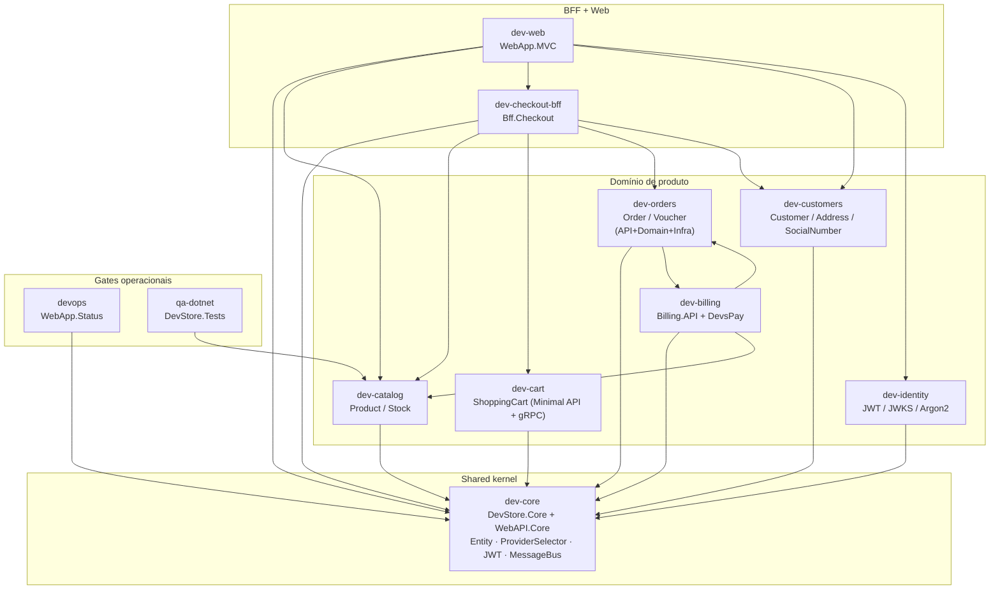

> **Nota sobre o ciclo orders↔billing:** o `depends_on` declara mão dupla (`orders → billing` e `billing → orders`). Isso **não** é um ciclo de compilação — é o par Request/Response da mensageria: Orders faz `_bus.Request<>` esperando resposta de Billing (dependência de contrato de evento), e Billing consome eventos originados em Orders. O acoplamento é via `IntegrationEvent` no shared kernel, não via `ProjectReference` cruzado.

---

## 2. Domínios de produto

### 2.1 dev-core — shared kernel

**Entry points:** `ApiCoreConfig.AddApiCoreConfiguration` (composição de toda API), `AddMessageBus` (bootstrap MassTransit/RabbitMQ). Não expõe endpoints HTTP próprios — é biblioteca.

**Fluxo típico:** na subida de qualquer serviço, `AddApiCoreConfiguration` encadeia a detecção de banco (`ProviderConfiguration.DetectDatabase` → `ProviderSelector`, que resolve entre SqlServer/MySql/Postgre/Sqlite por `AppSettings:DatabaseType`, nunca hardcoded), a configuração de JWT (`JwtConfig`) e os health checks. Em paralelo, `AddMessageBus` monta o bus na ordem canônica `AddConsumers(assemblies) → UsingRabbitMq → ConfigureEndpoints(context)` — âncora gold `messagebus_bootstrap` em `DevStore.MessageBus/DependencyInjectionExtensions.cs`. Domínio: `Entity` (nunca `BaseEntity`) + marker `IAggregateRoot`; erro de negócio por dois canais que nunca se misturam dentro de um mesmo `CommandHandler.Handle` — `DomainException` (Value Objects) e `ValidationResult`/`AddError` (Commands/MediatR).

**Abstrações-chave:** `Entity` · `IAggregateRoot` · `IRepository<T>` (nunca `IGateway`/`IClient`) · `ProviderSelector` · `IntegrationEvent` (contrato publicado entre serviços) · `CommandHandler`.

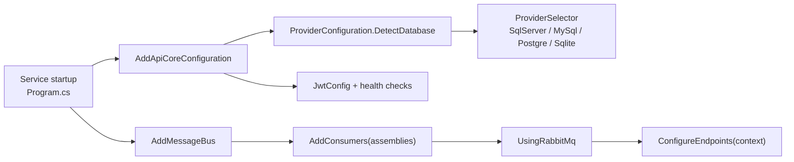

---

### 2.2 dev-catalog — Product / Stock

**Entry points:** `CatalogController` (leitura HTTP de produtos) · `CatalogIntegrationHandler` (consumer reativo de eventos de pedido).

**Fluxo típico:** a leitura é CRUD direto, sem CQRS (ausência deliberada de MediatR nesta fronteira): `CatalogController.Index` → `ProductRepository.GetAll` (usando `AsNoTrackingWithIdentityResolution()`, âncora gold `repository_query_otimizado`) → `PagedResult<Product>`. A baixa de estoque é **assíncrona e reativa**, não acontece no fluxo síncrono da compra: `CatalogIntegrationHandler` consome `OrderAuthorizedIntegrationEvent` → `Product.TakeFromInventory` → publica `OrderLoweredStockIntegrationEvent`. Consequência de design a registrar: o pedido pode já estar autorizado antes de a baixa de estoque ocorrer (janela de delay assíncrono).

**Abstrações-chave:** `Product` (único aggregate root do repo com setters públicos — desvio conhecido, DDD-lite, não "corrigir" incidentalmente) · `ProductRepository` · `CatalogIntegrationHandler`.

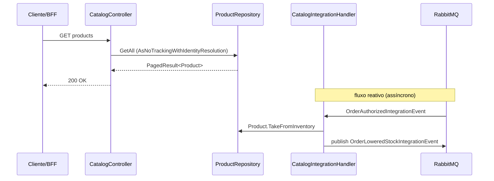

---

### 2.3 dev-customers — Customer / Address / SocialNumber

**Entry points:** `CustomerController.AddAddress` (único `HttpPost` de escrita nesta fronteira) · `NewCustomerIntegrationHandler` (criação reativa de Customer).

**Fluxo típico:** a criação de `Customer` é **100% reativa** e nunca via HTTP direto — `NewCustomerIntegrationHandler` consome `UserRegisteredIntegrationEvent` (publicado por dev-identity), checa duplicidade de `SocialNumber`, monta `NewCustomerCommand` e entra no pipeline CQRS via MediatR, respondendo ao Request de Identity com `ResponseMessage`. A escrita disponível por HTTP é apenas endereço: `CustomerController.AddAddress` → `AddAddressCommand` → `CustomerCommandHandler` (que chama `IsValid()` como primeira linha, pois não há `IPipelineBehavior` de validação no repo) → `CustomerRepository`. `Address` é sempre `Entity` filha de `Customer` (FK `CustomerId`), nunca aggregate root próprio.

**Abstrações-chave:** `NewCustomerIntegrationHandler` · `CustomerCommandHandler` · validator `AbstractValidator<T>` aninhado dentro do próprio Command (âncora gold `validator_nested`) · `CustomerContext` (com `QueryTrackingBehavior.NoTracking` + `AutoDetectChangesEnabled=false`, âncora gold `dbcontext_tracking`).

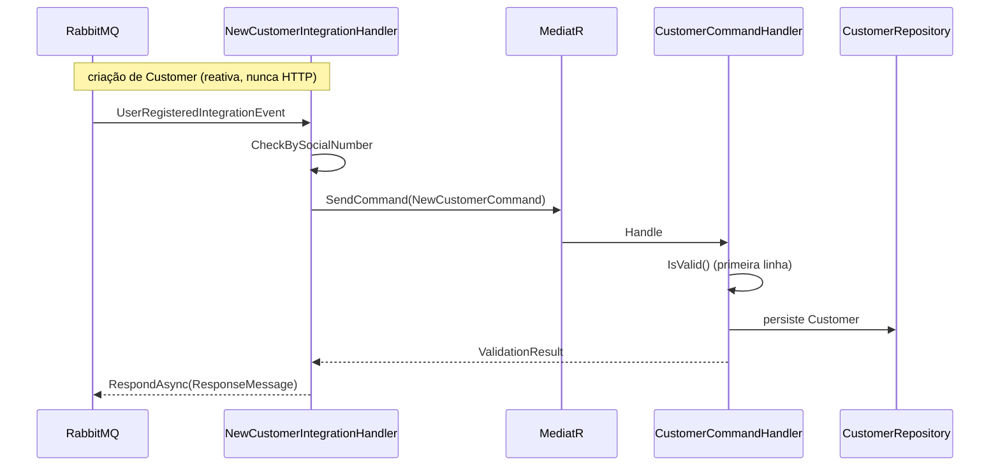

---

### 2.4 dev-identity — JWT / JWKS / Argon2

**Entry points:** `AuthController.Register` · `AuthController.Login` · `AuthController.RefreshToken` · `ValidateJwt` (apenas sob `#if DEBUG`).

**Fluxo típico:** `Register` implementa uma **saga de compensação manual** (não há orquestrador formal / MassTransit Saga no repo): cria o usuário via `UserManager.CreateAsync` → publica `UserRegisteredIntegrationEvent` por `IBus.Request<>` esperando confirmação de dev-customers (timeout default de 30s, teto do MassTransit) → em sucesso, o `JwtBuilder` fluente (`WithUserId/WithEmail/WithJwtClaims/...`) emite o JWT; em falha, `DeleteAsync` desfaz a criação do usuário (rollback manual). `Login` e `RefreshToken` reusam o mesmo `JwtBuilder`. Hashing de senha é exclusivamente Argon2, com ponto único de configuração em `IdentityConfig.UseArgon2<>` — nunca replicado em `AuthController`.

**Abstrações-chave:** `JwtBuilder` (ponto único de emissão de token) · `IdentityConfig` (Argon2) · JWKS rotativo (`SecurityKeys`/`ISecurityKeyContext`, `KeepFor` lido em `WebAPI.Core/Identity/JwtConfig.cs`) · saga de compensação manual.

> **Cuidado transversal (SEC-2):** o builder já injeta `Email` como claim — qualquer claim sensível adicionada aqui não pode vazar em log de payload de token.

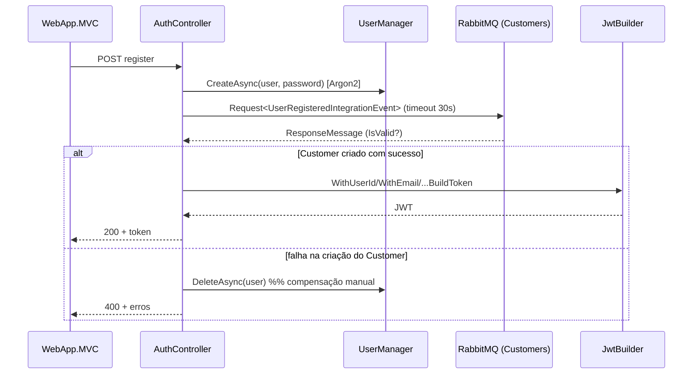

---

### 2.5 dev-orders — Order / Voucher (API + Domain + Infra)

**Entry points:** `OrderController.AddOrder` (delega 100% para MediatR — âncora gold `controller_cqrs`). Rotas de leitura/Voucher: a existência de um `VoucherController` **não está confirmada** pelo contexto extraído — o acesso a Voucher no fluxo de criação passa por `IVoucherRepository.GetVoucherByCode` dentro do handler, mas a superfície HTTP exata de voucher permanece **incerta** e não é afirmada aqui.

**Fluxo típico:** `OrderController.AddOrder` → `OrderCommandHandler`: cria `Order` → aplica `Voucher` via `VoucherValidation` (Specification pattern; Voucher é aggregate root independente, associado por `VoucherId` nullable, nunca mutado por `order.Voucher.*`) → `CalculateOrderAmount()` **recalcula 100% no servidor** a partir dos itens + desconto de voucher e **rejeita** se `Amount`/`Discount` do cliente divergir (BIZ-1 e BIZ-2, defesa anti-fraude — âncoras `IsOrderValid`, `OrderCommandHandler.cs:110-130`). Confirmado o valor, `DoPayment` monta `OrderInitiatedIntegrationEvent` (que carrega dados de cartão em claro — ver §4) e faz `_bus.Request<>` **síncrono e bloqueante** para dev-billing. Em sucesso: `order.Authorize()` → persiste → publica `OrderDoneIntegrationEvent` (assíncrono, dispara limpeza de carrinho e demais reações).

**Abstrações-chave:** `Order` (âncora gold `entity_aggregate_root`: construtor + `{ get; private set; }` + métodos de invariante) · `Voucher` + `VoucherValidation` (Specification) · `OrderCommandHandler` · a fronteira formal de camadas Orders.Domain (puro) → Orders.Infra (`IOrderRepository`), único contrato de layering FORMAL do repo.

> **Anotação (BIZ-3, gap de backlog):** `OrderStatus` tem 5 valores mas só 3 transições implementadas (`Authorize`/`Finish`/`Cancel`); `Refused`/`Delivered` existem no enum sem método correspondente. Gap conhecido, não bug.
>
> **Anotação (NET9-STACK-008):** o `_bus.Request<>` de pagamento hoje não tem try/catch para `RequestTimeoutException` — risco documentado.

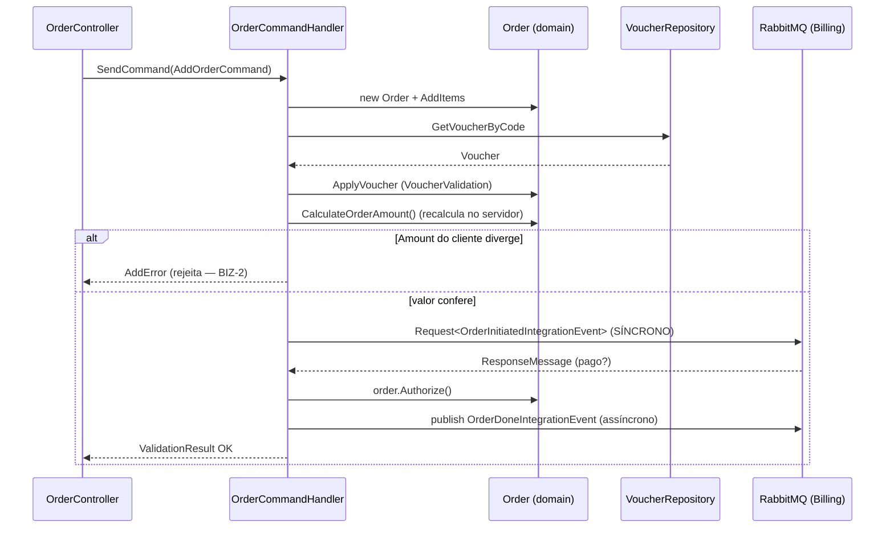

---

### 2.6 dev-billing — Billing.API + Billing.DevsPay

**Entry points:** `BillingIntegrationHandler` (3 `IConsumer<T>`). `PaymentController` é **classe vazia** por design — não há superfície HTTP; a fronteira é 100% mensageria.

**Fluxo típico:** `BillingIntegrationHandler` consome `OrderInitiatedIntegrationEvent` → `CreditCardPaymentFacade` → `DevsPay.Transaction` **em memória** (lib in-process via `ProjectReference`, sem HTTP real; `Bogus.Random.Bool(0.7f)` simula ~70% de aprovação) → converte o status e **responde ao `Request<>` síncrono de dev-orders**. Consome também `OrderLoweredStockIntegrationEvent` (captura o pagamento, sempre `Paid`) e `OrderCanceledIntegrationEvent` (cancela, sempre `Cancelled`). Como o "gateway" é in-process, não há timeout/rate-limit/retry de rede a simular contra ele — o ponto de falha real é a mensageria (RabbitMQ indisponível).

**Abstrações-chave:** `BillingIntegrationHandler` (âncora gold `integration_consumer`) · `CreditCardPaymentFacade` · `DevsPay.Transaction` (simulador in-process) · dois enums `TransactionStatus` distintos (Billing.API vs DevsPay).

> **Anotações críticas (ver §4):** (a) cast **posicional** de enum em `CreditCardPaymentFacade.cs:73` mapeia semântica errada silenciosamente (`DevsPay.Chargeback(4)` → `Billing.Refund(4)`); (b) `BillingService` (Authorize/Capture/Cancel) **não tem idempotência** — redelivery do RabbitMQ duplicaria a operação (SEC-3); (c) o evento consumido carrega dados de cartão em claro (não logar/repersistir o payload completo).

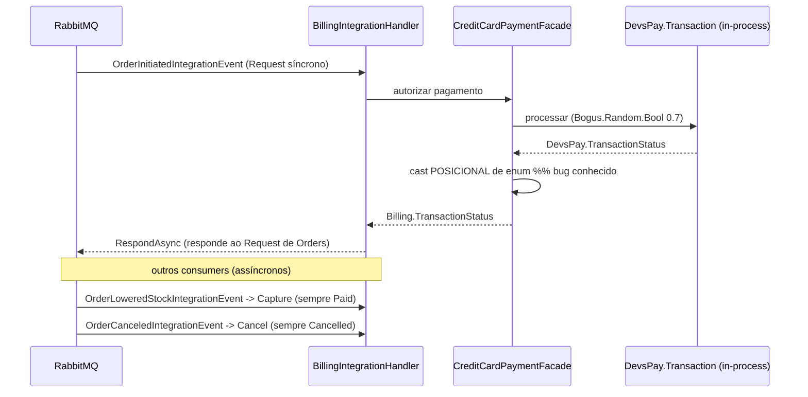

---

### 2.7 dev-cart — ShoppingCart (Minimal API + gRPC)

**Entry points:** rotas HTTP via **Minimal API** em `Program.cs` (único serviço do repo sem pasta `Controllers/`) · endpoint gRPC `ShoppingCartOrders.GetShoppingCart` (`Protos/shoppingcart.proto`, consumido pelo BFF via stub gerado em build) · `ShoppingCartIntegrationHandler` (consumer reativo).

**Fluxo típico:** operações de carrinho seguem o padrão `[Authorize] async (params) => ...` com `.WithName/.WithTags/.Produces*`; `CustomerShoppingCart.AddItem` respeita `MAX_ITEMS = 5` (constante de negócio hardcoded em `CustomerShoppingCart.cs:8`, não configuração). A limpeza do carrinho é **exclusivamente reativa**: `ShoppingCartIntegrationHandler` consome `OrderDoneIntegrationEvent` → `RemoveShoppingCart(ClientId)`. Não há uma segunda remoção síncrona no checkout — duplicá-la criaria race condition com o fluxo reativo.

**Abstrações-chave:** Minimal API (âncora gold `minimal_api`, padrão isolado, não convenção dominante) · `CustomerShoppingCart` · contrato gRPC `shoppingcart.proto` (acoplamento de **build** com o BFF, não de runtime) · `ShoppingCartContext` (NoTracking global já configurado).

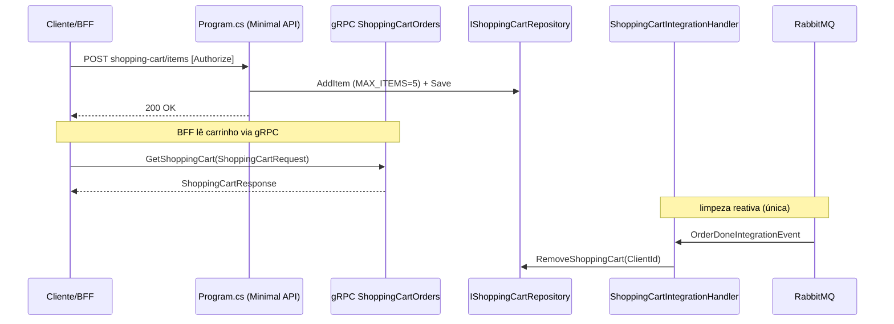

---

### 2.8 dev-checkout-bff — Bff.Checkout

**Entry points:** Controllers finos (ex. `OrderController`) que orquestram os serviços de produto. Cada rota compõe chamadas sequenciais a clients tipados.

**Fluxo típico:** o BFF é camada de **composição, não de domínio**. Consome Catalog (HTTP), Cart (**HTTP ou gRPC — os dois caminhos coexistem por endpoint**, escolha determinada pelo Controller, não é preferência de estilo), Orders (HTTP) e Customer (HTTP), todos via clients que herdam da base abstrata `Service` (`Services/Service.cs:10`) — nunca `HttpClient` cru. O tratamento de status code é centralizado em `ManageHttpResponse`. A interface `IPaymentService` existe **vazia** de propósito: o fluxo real de pagamento passa por `OrderService` → Orders.API → Billing.API; completá-la criaria uma segunda rota de pagamento concorrente.

**Abstrações-chave:** `Service` (base abstrata dos clients: `GetContent`/`DeserializeResponse`/`ManageHttpResponse`) · `IShoppingCartService` (HTTP) vs `IShoppingCartGrpcService` (gRPC), não intercambiáveis · `OrderDto` (carrega os mesmos campos de cartão em claro que trafegam no bus — superfície adicional de PCI, ver §4).

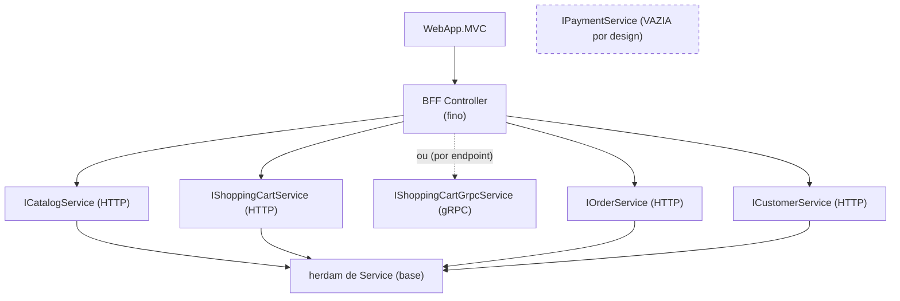

---

### 2.9 dev-web — WebApp.MVC

**Entry points:** Controllers MVC (`ShoppingCartController`, `OrderController`, etc.) servindo Views Razor. É a única superfície voltada ao browser.

**Fluxo típico:** fronteira **100% consumidora HTTP**, sem nenhum acesso a domínio de backend (`.csproj` só referencia `DevStore.Core`/`DevStore.WebAPI.Core`). Checkout típico: `ShoppingCartController` → `CheckoutBffService.GetShoppingCart` → `OrderController.DeliveryAddress` agrega carrinho + endereço → `CheckoutBffService.MapToOrder` → `FinishOrder` (POST `/orders` no BFF) → `OrderDone` → `GetLastOrder` (`CheckoutBffService.cs:112-154`). Todos os clients são `HttpClient` tipado + Polly (retry 1s/5s/10s + circuit breaker 5x/30s); Refit está no `.csproj` apenas como dependência vestigial para capturar `ValidationApiException`/`ApiException` em `ExceptionMiddleware.cs`, nunca como client ativo. O token Bearer é propagado por `HttpClientAuthorizationDelegatingHandler`; a **sessão do browser é por Cookie** (`CookieAuthenticationDefaults`), não Bearer direto.

**Abstrações-chave:** `CheckoutBffService` · clients tipados + `PollyExtensions` (retry/circuit breaker) · `HttpClientAuthorizationDelegatingHandler` · `ExceptionMiddleware` · ViewModels (`OrderViewModel` etc.) como **espelho passivo** da resposta do BFF — sem lógica de cálculo próprio (DOMAIN-WEB-004).

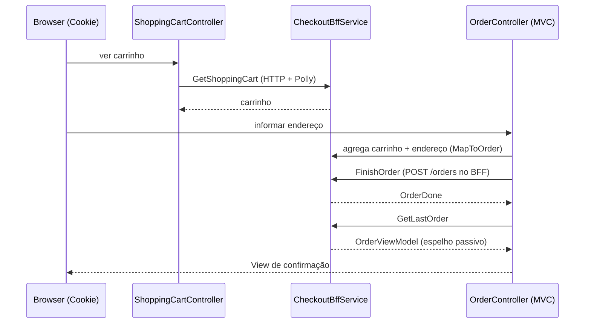

---

## 3. Fluxos cross-domain

### 3.1 Checkout end-to-end (Web → BFF → Cart/Catalog → Orders → Billing → volta)

Combina os dois padrões de integração: HTTP/gRPC do web até Orders, `Request/Response` **síncrono** Orders→Billing, e `Publish/Consume` **assíncrono** na cauda (limpeza de carrinho + baixa de estoque). A validação anti-fraude (BIZ-2) acontece em Orders, antes de acionar Billing.

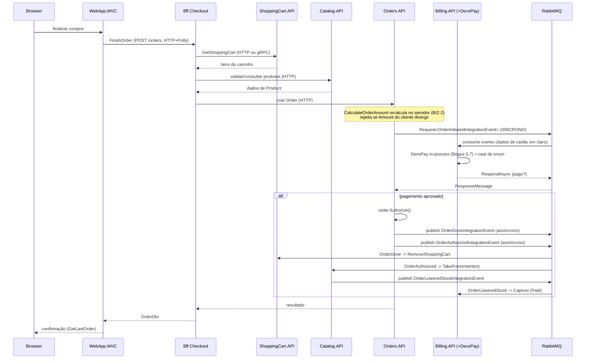

> **Nota de sequência:** a ordem exata de publicação entre `OrderDoneIntegrationEvent` e `OrderAuthorizedIntegrationEvent` e quais consumers reagem a cada um está representada conforme os fluxos confirmados por fronteira (§2.2 catalog consome `OrderAuthorized`; §2.7 cart consome `OrderDone`; §2.6 billing consome `OrderLoweredStock`/`OrderCanceled`). A sequência temporal precisa entre esses dois publishes **não foi confirmada** no contexto extraído — o diagrama mostra ambos como reações à autorização, sem afirmar precedência estrita.

---

### 3.2 Registro de usuário (Web → Identity → Customers, com saga de compensação manual)

Fluxo `Request/Response` **síncrono** entre Identity e Customers, com rollback manual (`DeleteAsync`) no lugar de um orquestrador formal — não há MassTransit Saga/StateMachine no repo.

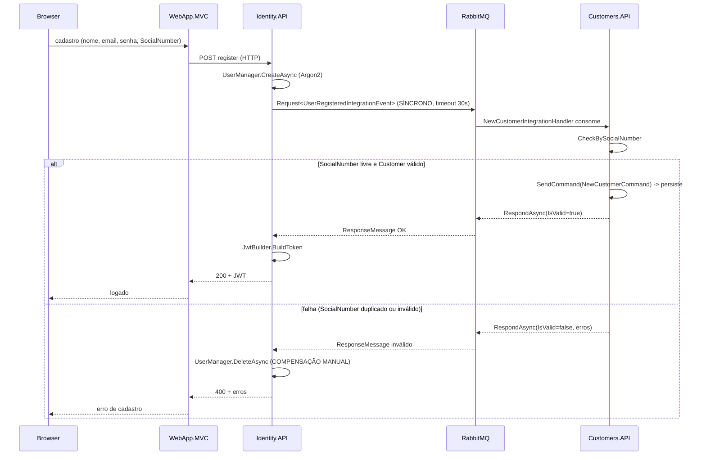

---

## 4. Débitos e riscos conhecidos

> Esta seção **documenta** os findings críticos confirmados no código. Não propõe correção — a decisão de sanar (e por qual caminho) cabe ao tech-lead e, para itens de segurança, ao gate `security`. Fora do escopo deste documento de fluxo.

| # | Finding | Fronteira dona | Evidência / âncora | Invariante tocada |
|---|---------|----------------|--------------------|-------------------|
| 1 | **Enum mismatch silencioso Billing ↔ DevsPay.** Cast posicional entre `DevsPay.TransactionStatus` e `Billing.API.TransactionStatus`; nomes coincidem mas a posição 4 diverge semanticamente (`DevsPay.Chargeback(4)` → `Billing.Refund(4)`), produzindo mapeamento errado sem erro. | dev-billing | `CreditCardPaymentFacade.cs:73`; comparar `Models/TransactionStatus.cs:3-9` nos dois projetos | — (correção lógica) |
| 2 | **Dados de cartão em claro no bus e no BFF (PCI-DSS).** `CardNumber`/`Holder`/`ExpirationDate`/`SecurityCode` trafegam em texto plano no `OrderInitiatedIntegrationEvent` (RabbitMQ) e são reexpostos em `OrderDto` no BFF. | Origem: dev-core/dev-orders (contrato do evento) · também dev-billing (consumidor) e dev-checkout-bff (`OrderDto`) | `DevStore.Core/Messages/Integration/OrderInitiatedIntegrationEvent.cs:12-15`; DOMAIN-BFF-004 | **SEC-2** (email/CPF/CardNumber/CVV nunca em claro) — requer gate `security` |
| 3 | **Billing sem idempotência.** `BillingService.Authorize/Capture/Cancel` não têm chave de deduplicação; redelivery do RabbitMQ duplicaria a operação de pagamento. | dev-billing | `BillingService.cs:24-118`; `grep 'Idempot\|MessageId'` retorna vazio | **SEC-3** (idempotência antes de nova funcionalidade que reprocesse eventos) |
| 4 | **`OrderStatus.Refused`/`Delivered` sem transição.** Os dois valores existem no enum mas não há método de domínio que os atinja — só 3 das 5 transições implementadas (`Authorize`/`Finish`/`Cancel`). | dev-orders | `Orders.Domain/Orders/OrderStatus.cs:3-9` vs `Order.cs:45-58`; `grep 'OrderStatus.Refused\|OrderStatus.Delivered'` só encontra a declaração | **BIZ-3** `[REVISAR-BACKLOG]` — gap conhecido, **não bloqueante** |

---

## Apêndice — Incertezas declaradas (não afirmadas como fato)

Itens que o contexto extraído **não confirma** e que, portanto, não foram apresentados como certos acima:

1. **Superfície HTTP de Voucher em dev-orders.** A existência e a rota exata de um `VoucherController` não constam do contexto. Confirmado apenas o acesso a Voucher **dentro** do fluxo de criação de pedido, via `IVoucherRepository.GetVoucherByCode` + `VoucherValidation`. Verificar antes de documentar como endpoint público: `grep -rn "class VoucherController" src/services/DevStore.Orders.API`.
2. **Precedência temporal entre `OrderDoneIntegrationEvent` e `OrderAuthorizedIntegrationEvent`.** Ambos são reações à autorização do pedido e cada um tem seu consumer confirmado, mas a ordem estrita de publicação não foi confirmada — representada no §3.1 sem afirmar sequência garantida.
3. **Rotas HTTP de escrita do carrinho além de `AddItem`.** O padrão Minimal API e o `MAX_ITEMS=5` estão confirmados; o conjunto completo de rotas (remoção/atualização de item) não foi enumerado no contexto e não é listado exaustivamente aqui.

---

**Arquivos de referência (leitura, sempre absolutos):**
`/Users/glaubercastro/Repositorios/dev-store/.swarm/knowledge/ORCHESTRATION_MAP.yaml` · `/Users/glaubercastro/Repositorios/dev-store/.swarm/knowledge/ARCHITECTURE_TREE.md` · `/Users/glaubercastro/Repositorios/dev-store/.swarm/knowledge/DOMAIN_INVARIANTS.yaml` · `/Users/glaubercastro/Repositorios/dev-store/.claude/rules/` (layer rules por fronteira).
